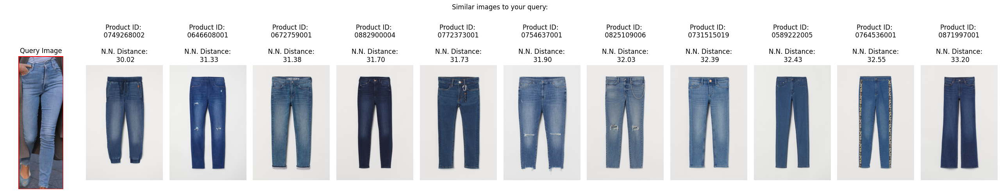
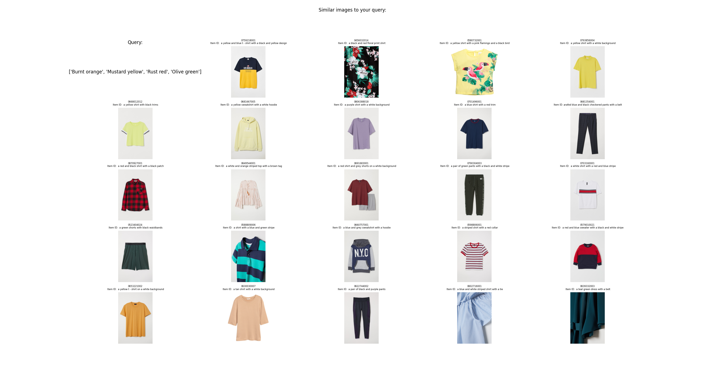

# Agentic CV + NLP (via LangChain Agent with custom tools)

## Overview

This repository contains the implementation of two use cases combining computer vision (CV) and natural language processing (NLP) tasks to create a responsive AI agent. The agent utilises [Langchain Agents](https://python.langchain.com/v0.1/docs/modules/agents/) along with [OpenAI's GPT-3.5 Turbo model](https://platform.openai.com/docs/models/gpt-3-5-turbo) to suggest items of clothing based on text and image inputs.

Clothing Dataset: https://www.kaggle.com/competitions/h-and-m-personalized-fashion-recommendations/data


### Similarity Search:


### Complementary Colours:



## Prerequisites

- Python 3.11 or later
- Required Python packages (install via `requirements.txt`)
- OpenAI API Key

## Installation

1. **Clone the Repository:**
   ```bash
   git clone https://github.com/MRK132/Agentic_CV_and_NLP_with_Langchain_Agents.git
   cd Agentic_CV_and_NLP_with_Langchain_Agents
   ```

2. **Install Dependencies:**
   ```bash
   pip3 install -r requirements.txt
   ```

3. **Prepare the Vector Databases:**
   - Extract the images from `images.zip` and create a [FAISS-based vector database.](https://github.com/facebookresearch/faiss)
   - Use an image captioning model to generate descriptions of each image.
   - Create a second vector database for the text embeddings of these captions.

## Use Cases

### Use Case 1: Find Garments Based on Text + Image

**Scenario:**
A user provides a chat message and an example image of someone wearing denim trousers. The agent suggests similar denim trousers.

**Process:**
1. Parse the user message using GPT-3.5.
2. Use object detection to identify clothing items in the provided image.
3. Crop and save the image of the specified item (trousers).
4. Perform a vector similarity search against the FAISS database.
5. Return the product IDs of the most similar items.

**Custom LangChain Agent Tools Used:**
- Object detection tool - [fashion object pretrained weights from HuggingFace](https://huggingface.co/valentinafeve/yolos-fashionpedia)
- Image cropping and saving tool
- Vector similarity search and image plot tool

### Use Case 2: Suggest Complementary Garments Based on Text + Image

**Scenario:**
A user provides a chat message and an image of a red jacket, asking for items that would go well with it in autumn colours.

**Process:**
1. Parse the user message using GPT-3.5.
2. Generate a caption for the provided image.
3. Extract desired colours from the user message.
4. Perform a similarity search for items with complementary colours, excluding the category of the provided item.
5. Return the product IDs from various categories with the specified colours.

**Custom LangChain Agent Tools Used:**
- Image captioning tool
- Colour extraction from text tool
- Image and text vector similarity search tools
- CSV referencing tool

## Implementation Details

### Agent Configuration

- **Model:** GPT-3.5 turbo
- **Framework:** Langchain Agents
- **Database:** FAISS for image and text vectors

### Workflow

1. **Image Processing:**
   - Preprocess the images to create vector representations.

2. **Message Parsing:**
   - Utilise GPT-3.5 in chat mode to understand user queries.
   - Decide on the appropriate application (similarity search or complementary colour search).

3. **Vector Similarity Search:**
   - Perform searches using FAISS for efficient retrieval of similar items.
   - Filter results based on the user's specifications.

4. **Results:**
   - Visualise results using Matplotlib.
   - Return product IDs for similar or complementary items.


## Running the Project

### With Python

You can run the project by specifying the use case as an environment variable:

For Use Case 1:
```bash
USER_QUESTION=Use_Case_1 python3 main.py
```

For Use Case 2:
```bash
USER_QUESTION=Use_Case_2 python3 main.py
```

### With Docker

1. **Build the Docker Image:**
   ```bash
   docker build -t agents .
   ```

2. **Run the Docker Container:**

   For Use Case 1:
   ```bash
   docker run -e USER_QUESTION="Use_Case_1" agents
   ```

   For Use Case 2:
   ```bash
   docker run -e USER_QUESTION="Use_Case_2" agents
   ```


## Future Improvements

- Experiment with multi-modal LLMs to solve the vision + text tasks.
- Experiment with multi-modal embeddings.
- Experiment with Poetry as an alternative to Docker.
- Create a Streamlit app for improved result visualisation.
- Implement logging for better tracking and debugging.
- Enhance exception handling for robustness.


